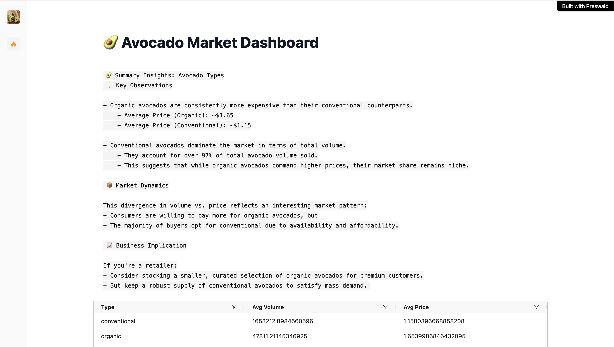
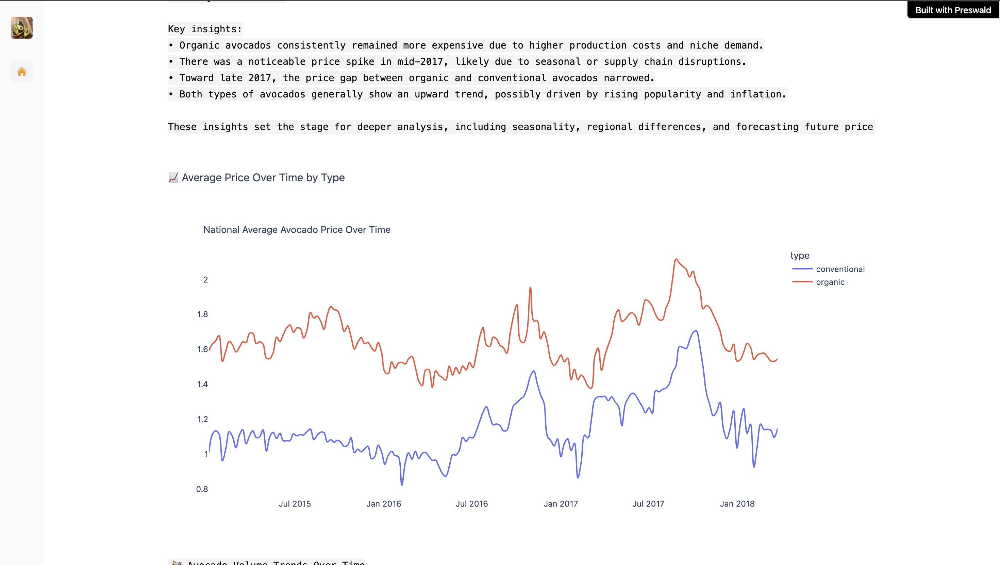
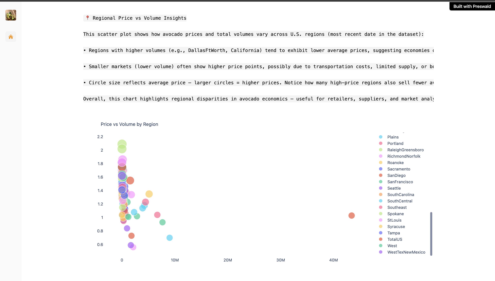

# 🥑 Preswald Avocado Market Dashboard

This project is a data dashboard built with [Preswald](https://preswald.com), showcasing trends in the avocado market using interactive visualizations.

## ⚙️ Local Setup Instructions

> 🚨 **Note:** Due to deployment issues, this project is currently **not hosted online**. Please run it locally by following the instructions below.

### 1. Clone the Repository
```bash
git clone https://github.com/yourusername/preswald_project.git
cd preswald_project

```

### 2. Set Up env

```bash
python -m venv .venv
source .venv/bin/activate
pip install preswald# On Windows use: .venv\Scripts\activate
```

## Run

```bash
preswald run
```

### Screenshots





